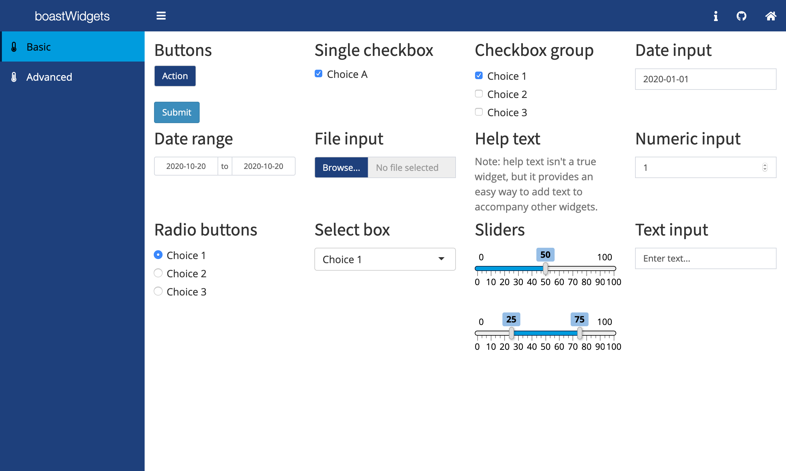

<!-- README.md is generated from README.Rmd. Please edit that file -->

```{r setup, include = FALSE}
knitr::opts_chunk$set(
  eval = FALSE,
  collapse = TRUE,
  comment = "#>",
  fig.path = "man/figures/README-",
  out.width = "100%"
)
```

Used to provide reusable [htmlwidgets](https://www.htmlwidgets.org/) for the [BOAST](https://github.com/EducationShinyAppTeam/BOAST) project.



## Available Widgets
- [Shiny Widgets](https://shiny.rstudio.com/tutorial/written-tutorial/lesson3/)
- Radial Poll
- More to come...

## Demo

:rocket:[Launch](https://psu-eberly.shinyapps.io/boastWidgets/)
