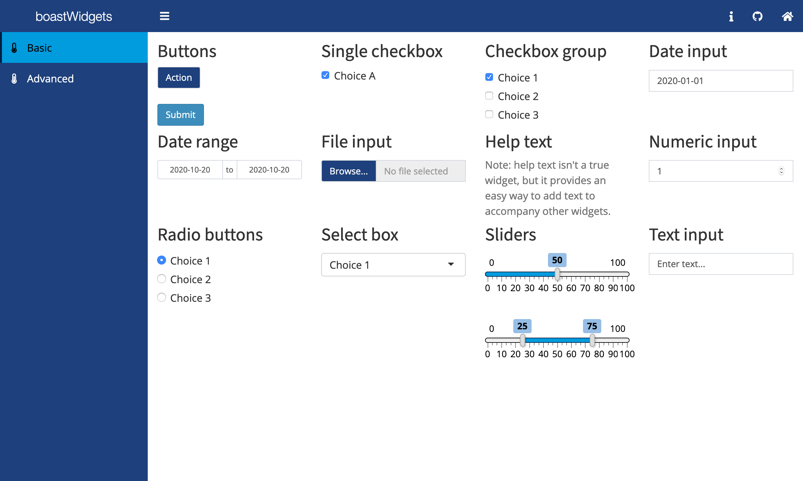

BOAST Widgets
================
EducationShinyAppTeam
October 20, 2020

<!-- README.md is generated from README.Rmd. Please edit that file -->

Used to provide reusable [htmlwidgets](https://www.htmlwidgets.org/) for
the [BOAST](https://github.com/EducationShinyAppTeam/BOAST) project.

Available Widgets
-----------------

-   [Shiny
    Widgets](https://shiny.rstudio.com/tutorial/written-tutorial/lesson3/)
-   Radial Poll
-   More to come…

Demo
----

:rocket:[Launch](https://psu-eberly.shinyapps.io/boastWidgets/)
